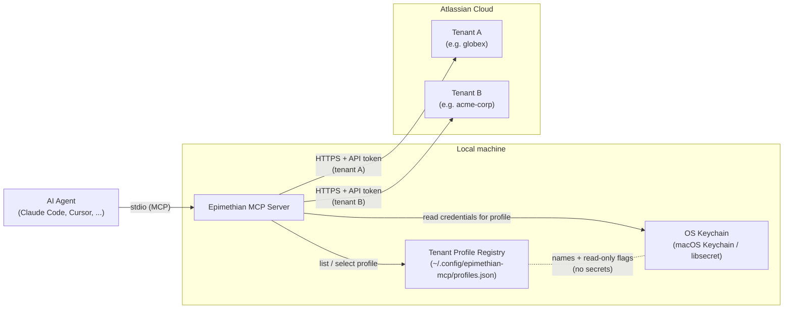

<p align="center">
  
</p>

# Epimethian MCP

A security-focused [MCP](https://modelcontextprotocol.io/) server that gives AI agents safe, multi-tenant access to Confluence Cloud. It provides some features not available in the official MCP server, like support for draw.io diagrams, macros, etc.

## Why use this?

The official [Atlassian MCP server](https://github.com/atlassian/atlassian-mcp-server) covers basic Confluence and Jira access. Epimethian targets gaps that matter for consultants, power users, and teams with strict security requirements:

- **OS keychain credential storage** — API tokens are stored in macOS Keychain or Linux libsecret, never in plaintext config files. Setup uses masked input so tokens don't leak into terminal scrollback.
- **Multi-tenant profile isolation** — Each Atlassian tenant gets its own named profile with fully separate credentials and keychain entries. No risk of cross-tenant writes when switching between clients.
- **Tenant-aware write safety** — Write operations echo the target tenant so the AI agent (and you) always see where changes are going.
- **draw.io diagram support** — Create and embed draw.io diagrams directly in Confluence pages (assuming the tenant has draw.io installed), something the official server doesn't expose.
- **Attribution tracking** — Edited pages are labelled `epimethian-edited` for easy discovery. Confluence version messages include the MCP client name (e.g. "Updated by Claude Code (via Epimethian v5.2.0)") so you can trace which AI-assisted edits touched which content.

If you don't need any of the above, the official Atlassian server is a fine choice.

## How it works

Epimethian runs as a local MCP server that your AI agent (Claude Code, Cursor, etc.) talks to over stdio. On startup it reads a profile name from the environment, pulls the matching credentials from your OS keychain, validates the connection against Confluence Cloud, and then exposes a set of tools the agent can call. All Confluence API calls go directly from your machine to Atlassian — there is no intermediate service.

## Quick Start

Tell your AI agent:

> Install and configure the Epimethian MCP server. See https://github.com/de-otio/epimethian-mcp

For a detailed agent-facing guide (installation, configuration, profile management, uninstallation), see [install-agent.md](install-agent.md) or run `epimethian-mcp agent-guide` after installation.

Or install manually:

```bash
npm install -g @de-otio/epimethian-mcp
epimethian-mcp setup --profile <name>
```

The `setup` command prompts for your Confluence URL, email, and API token (masked input), tests the connection, and stores all credentials securely in your OS keychain under the named profile.

## MCP Configuration

Add to your `.mcp.json` (or equivalent MCP client config):

```json
{
  "mcpServers": {
    "confluence": {
      "command": "epimethian-mcp",
      "env": {
        "CONFLUENCE_PROFILE": "my-profile"
      }
    }
  }
}
```

All credentials (URL, email, token) are read from the OS keychain at startup. **Only the profile name goes in config files.**

For IDE-hosted agents, use the absolute path from `which epimethian-mcp` as the `command` value.

## Multi-Tenant Support

Consultants and developers working across multiple Atlassian tenants can create a profile per tenant:

```bash
epimethian-mcp setup --profile globex
epimethian-mcp setup --profile acme-corp
```

Each project's `.mcp.json` specifies which profile to use. Profiles are fully isolated — separate keychain entries, separate Confluence instances, separate MCP server names (`confluence-globex`, `confluence-acme-corp`).

Manage profiles:

```bash
epimethian-mcp profiles              # list all (shows read-only status)
epimethian-mcp profiles --verbose    # show URLs, emails, and read-only status
CONFLUENCE_PROFILE=globex epimethian-mcp status   # test connection
epimethian-mcp profiles --remove <name>           # delete profile and credentials
```

The `--remove` command deletes the profile's keychain entry and registry record after interactive confirmation. For non-interactive environments (CI, agent shell sessions), pass `--force` to skip the prompt.

### Per-Profile Read-Only Mode

Protect client tenants from accidental writes:

```bash
epimethian-mcp profiles --set-read-only acme-corp
epimethian-mcp profiles --set-read-write globex
```

New profiles default to **read-only**. The `setup` command prompts "Enable writes for this profile? [y/N]" or accepts `--read-write` for non-interactive use.

When a profile is read-only, all write tools (`create_page`, `update_page`, `update_page_section`, `delete_page`, `add_attachment`, `add_drawio_diagram`, `add_label`, `remove_label`, `create_comment`, `resolve_comment`, `delete_comment`, `set_page_status`, `remove_page_status`) return an error with a remediation command. Read tools work normally. The read-only flag is resolved at server startup — restart running servers after changing it.

## Token Efficiency

Confluence pages are verbose — storage format HTML with macro markup can easily reach 50,000+ tokens. Epimethian reduces token usage through several strategies, all lossless with respect to Confluence data:

- **Drill-down pattern** — Use `headings_only` to get a page outline (~500 tokens), then `section` to read just the part you need in storage format. No need to fetch the full page body.
- **Section-level editing** — `update_page_section` replaces content under a single heading. The rest of the page is never touched, eliminating the need to send the full body on updates.
- **Page cache** — An in-memory, version-keyed cache eliminates redundant API calls during iterative editing. After updating a page, subsequent reads serve from cache (~90% fewer tokens on repeated reads).
- **Search excerpts** — Search results include content previews so the agent can triage results without calling `get_page` on each one.
- **Markdown view** — `format: "markdown"` returns a compact read-only rendering where macros become `[macro: name]` placeholders. The server rejects any attempt to write markdown back — storage format is the only accepted write format.
- **Truncation** — `max_length` cuts the body at an element boundary with a `[truncated at N of M characters]` marker.

## Tools

| Tool                  | Description                                                            |
| --------------------- | ---------------------------------------------------------------------- |
| `create_page`         | Create a new page                                                      |
| `get_page`            | Read a page by ID (`headings_only`, `section`, `max_length`, `format`) |
| `get_page_by_title`   | Look up a page by title (same options as `get_page`)                   |
| `update_page`         | Update an existing page                                                |
| `update_page_section` | Update a single section by heading name                                |
| `delete_page`         | Delete a page                                                          |
| `list_pages`          | List pages in a space                                                  |
| `get_page_children`   | Get child pages                                                        |
| `search_pages`        | Search via CQL (includes content excerpts)                             |
| `get_spaces`          | List available spaces                                                  |
| `add_attachment`      | Upload a file attachment                                               |
| `get_attachments`     | List attachments on a page                                             |
| `add_drawio_diagram`  | Add a draw.io diagram                                                  |
| `get_labels`          | Get all labels on a page                                               |
| `add_label`           | Add one or more labels to a page                                       |
| `remove_label`        | Remove a label from a page                                             |
| `get_comments`        | Read page comments (footer and inline)                                 |
| `create_comment`      | Add a comment to a page                                                |
| `resolve_comment`     | Resolve or reopen an inline comment                                    |
| `delete_comment`      | Delete a comment                                                       |
| `get_page_status`     | Get the content status badge on a page                                 |
| `set_page_status`     | Set the content status badge on a page                                 |
| `remove_page_status`  | Remove the content status badge from a page                            |
| `get_page_versions`   | List version history for a page                                        |
| `get_page_version`    | Get page content at a specific historical version (read-only markdown) |
| `diff_page_versions`  | Compare two versions of a page                                         |
| `prepend_to_page`     | Insert content at the beginning of a page (additive, safe)             |
| `append_to_page`      | Insert content at the end of a page (additive, safe)                   |
| `revert_page`         | Revert a page to a previous version (lossless)                         |
| `lookup_user`         | Search for Atlassian users by name or email                            |
| `resolve_page_link`   | Resolve a page title + space key to a stable page ID and URL           |
| `get_version`         | Return the server version                                              |

## Content Safety

Write operations are protected by layered safety guards to prevent accidental content loss:

- **Shrinkage guard** — `update_page` rejects writes that reduce the body by more than 50%. Pass `confirm_shrinkage: true` to override.
- **Structural integrity** — rejects writes that drop more than 50% of headings. Pass `confirm_structure_loss: true` to override.
- **Empty-body rejection** — hard guard, no opt-out. Rejects writes that produce near-empty pages.
- **Additive tools** — `prepend_to_page` and `append_to_page` avoid full-body replacement entirely.
- **Lossless revert** — `revert_page` uses raw storage format, avoiding lossy markdown conversion.
- **Mutation log** — opt-in via `EPIMETHIAN_MUTATION_LOG=true`. Writes JSONL records to `~/.epimethian/logs/` for every write operation.

## Credential Security

- Credentials are stored per-profile in the OS keychain (macOS Keychain / Linux libsecret)
- URL, email, and API token are stored as an atomic unit — no mixing across profiles
- Tokens are never written to disk in plaintext
- The `setup` command uses masked input so tokens don't appear in terminal scrollback
- Startup validation verifies credentials, tenant identity (email), and tenant seal (cloudId) before accepting tool calls. Sealed profiles fail closed if the tenant-id endpoint is unreachable.
- Write operations include a tenant echo so the target is always visible
- For CI/headless environments, set all three env vars (`CONFLUENCE_URL`, `CONFLUENCE_EMAIL`, `CONFLUENCE_API_TOKEN`) — partial combinations are rejected
- Updates are **check-and-notify** by default. Run `epimethian-mcp upgrade` to install — the CLI verifies the npm provenance attestation first and refuses to install without it. Set `EPIMETHIAN_AUTO_UPGRADE=patches` to opt in to automatic patch installs (same integrity check).

For a full security & safety evaluation — threat model, defence-in-depth mechanisms, known limitations — see [doc/design/security/](doc/design/security/README.md).

## Development

```bash
git clone https://github.com/de-otio/epimethian-mcp.git
cd epimethian-mcp
npm install
npm run build
npm test
```

## Architecture



The MCP server resolves the active profile from `CONFLUENCE_PROFILE`, loads its URL/email/token from the keychain, and talks directly to the matching Atlassian tenant. The profile registry stores only non-secret metadata (profile names, read-only flags); tokens never leave the keychain in plaintext.

## License

[MIT](LICENSE)
