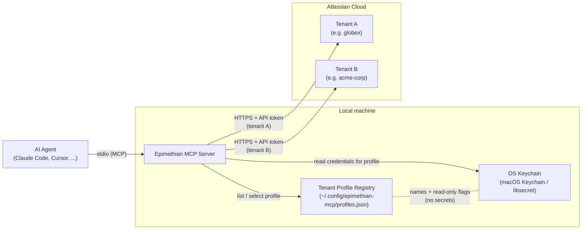

<p align="center">
  
</p>

# Epimethian MCP

A security-focused [MCP](https://modelcontextprotocol.io/) server that gives AI agents safe, multi-tenant access to Confluence Cloud. It provides some features not available in the official MCP server, like support for draw.io diagrams, macros, etc.

**What's new (v7.0.0):** `find_replace` now requires each `find` to match exactly once (opt in to several with `replace_all: true`), and `update_page_sections` accepts `find_replace` per section. Every body returned by `get_page` and `get_page_by_title` sits inside the untrusted-content fence. `search_pages` can be scoped to a profile's `read_spaces` and redact `redact_patterns` from titles and excerpts. HTTP requests have timeouts and bounded retries, and a write whose outcome is unknown blocks `version: "current"` writes to that page until a fresh read. Every tool declares annotations. Breaking changes are listed in [CHANGELOG.md](CHANGELOG.md).

**What's new (v6.8.0):** `authorise_destructive_writes` + `batch_token` field on every destructive tool — pre-authorise a batch of destructive writes with a single user prompt, then fan out the actual writes (sub-agent fan-out, bulk doc refreshes) without each one going through its own elicitation. Page-id-scoped (no wildcards), TTL-bounded, operation-bounded; validation failures fall through transparently to the per-call gate. v6.7.2 flipped `EPIMETHIAN_TOKEN_IN_TEXT` to default-on (opt out via `EPIMETHIAN_HIDE_TOKEN_IN_TEXT=true`), closing the under-configured-install gap for Claude Code users. v6.6.0–6.6.3 introduced soft-confirmation token round-trip for clients without working elicitation: single-use, diff-bound tokens; fast-decline auto-detection (the Claude Code "fakes elicitation" bug now Just Works without `EPIMETHIAN_BYPASS_ELICITATION`); `outputSchema` so spec-compliant clients forward the structured payload to the agent; SDK-compat hotfix for `z.object` output schemas. v6.5 added per-client setup CLI snippets (`epimethian-mcp setup --client …`). v6.4.1 added atomic multi-section updates and find-replace mode. See [CHANGELOG.md](CHANGELOG.md) for full details.

## Why use this?

The official [Atlassian MCP server](https://github.com/atlassian/atlassian-mcp-server) covers basic Confluence and Jira access. Epimethian targets gaps that matter for consultants, power users, and teams with strict security requirements:

- **OS keychain credential storage** — API tokens are stored in macOS Keychain or Linux libsecret, never in plaintext config files. Setup uses masked input so tokens don't leak into terminal scrollback.
- **Multi-tenant profile isolation** — Each Atlassian tenant gets its own named profile with fully separate credentials and keychain entries. No risk of cross-tenant writes when switching between clients.
- **Tenant-aware write safety** — Write operations echo the target tenant so the AI agent (and you) always see where changes are going.
- **draw.io diagram support** — Create and embed draw.io diagrams directly in Confluence pages (assuming the tenant has draw.io installed), something the official server doesn't expose.
- **Attribution tracking** — Edited pages are labelled `epimethian-edited` for easy discovery. Confluence version messages include the MCP client name (e.g. "Updated by Claude Code (via Epimethian v5.2.0)") so you can trace which AI-assisted edits touched which content.

If you don't need any of the above, the official Atlassian server is a fine choice.

## How it works

Epimethian runs as a local MCP server that your AI agent (Claude Code, Cursor, etc.) talks to over stdio. On startup it reads a profile name from the environment, pulls the matching credentials from your OS keychain, validates the connection against Confluence Cloud, and then exposes a set of tools the agent can call. All Confluence API calls go directly from your machine to Atlassian — there is no intermediate service.

## Quick Start

Tell your AI agent:

> Install and configure the Epimethian MCP server. See https://github.com/de-otio/epimethian-mcp

For a detailed agent-facing guide (installation, configuration, profile management, uninstallation), see [install-agent.md](install-agent.md) or run `epimethian-mcp agent-guide` after installation.

Or install manually:

```bash
npm install -g @de-otio/epimethian-mcp
epimethian-mcp setup --profile <name>
```

The `setup` command prompts for your Confluence URL, email, and API token (masked input), tests the connection, and stores all credentials securely in your OS keychain under the named profile.

## MCP Configuration

Add to your `.mcp.json` (or equivalent MCP client config):

```json
{
  "mcpServers": {
    "confluence": {
      "command": "epimethian-mcp",
      "env": {
        "CONFLUENCE_PROFILE": "my-profile"
      }
    }
  }
}
```

All credentials (URL, email, token) are read from the OS keychain at startup. **Only the profile name goes in config files.**

For IDE-hosted agents, use the absolute path from `which epimethian-mcp` as the `command` value.

## Multi-Tenant Support

Consultants and developers working across multiple Atlassian tenants can create a profile per tenant:

```bash
epimethian-mcp setup --profile globex
epimethian-mcp setup --profile acme-corp
```

Each project's `.mcp.json` specifies which profile to use. Profiles are fully isolated — separate keychain entries, separate Confluence instances, separate MCP server names (`confluence-globex`, `confluence-acme-corp`).

Manage profiles:

```bash
epimethian-mcp profiles              # list all (shows read-only status)
epimethian-mcp profiles --verbose    # show URLs, emails, and read-only status
CONFLUENCE_PROFILE=globex epimethian-mcp status   # test connection
epimethian-mcp profiles --remove <name>           # delete profile and credentials
```

The `--remove` command deletes the profile's keychain entry and registry record after interactive confirmation. For non-interactive environments (CI, agent shell sessions), pass `--force` to skip the prompt.

### Per-Profile Read-Only Mode

Protect client tenants from accidental writes:

```bash
epimethian-mcp profiles --set-read-only acme-corp
epimethian-mcp profiles --set-read-write globex
```

New profiles default to **read-only**. The `setup` command prompts "Enable writes for this profile? [y/N]" or accepts `--read-write` for non-interactive use.

When a profile is read-only, write tools are **not registered** at all — the agent's tool list is truthful and contains only read tools plus `check_permissions`. The posture is resolved at server startup — restart running servers after changing it.

## Read-Only Mode

**Read-only is the recommended posture for most users.** It provides defense-in-depth: even if the underlying API token has write access, the MCP will not expose write tools to the agent. This protects against prompt-injection attacks, accidental mutations during exploratory sessions, and misconfigured agents.

### Configuring posture

Set `posture` in the profile settings (preferred):

```jsonc
// ~/.config/epimethian-mcp/profiles.json
{
  "profiles": {
    "my-profile": {
      "posture": "read-only"
    }
  }
}
```

Or use the legacy environment variable (still supported):

```bash
CONFLUENCE_READ_ONLY=true
```

The `posture` setting is a tri-state:

| Value | Behavior |
|---|---|
| `"read-only"` | Write tools are never registered, regardless of what the token can do. |
| `"read-write"` | Write tools are always registered. Writes that fail at the API level return remediation messages. |
| `"detect"` (default) | A startup probe infers the effective posture from the token's actual permissions. |

The legacy `readOnly: boolean` profile key remains supported as an alias and is resolved to `posture: "read-only"` / `"read-write"`. Users should migrate to `posture` directly.

### MCP posture is independent of token capability

You can pin the MCP to read-only even when the API token has full write access. This is the "belt and suspenders" case: the Confluence permission boundary enforces one layer, and the MCP profile enforces another. The `check_permissions` tool makes the distinction visible — it reports both the configured posture and what the probe determined the token can actually do.

### Startup probe (posture: "detect")

When posture is `"detect"`, Epimethian runs a lightweight probe at startup to determine whether the token can write. The probe queries the Confluence permissions endpoint for the first available space and, if that is unavailable, falls back to a dry-run write attempt. The result is logged as a startup banner and drives which tools are registered for the session.

Probe outcomes:

- Token can write → effective posture is `read-write`; all tools registered.
- Token is read-only → effective posture is `read-only`; write tools not registered.
- Probe inconclusive → effective posture defaults to `read-write` with a visible warning.

### Checking permissions

The `check_permissions` tool is always registered, in every posture. Call it from the agent to inspect the configured posture, effective posture, probe result, and token capability. For operator diagnostics from the CLI:

```bash
CONFLUENCE_PROFILE=my-profile epimethian-mcp permissions my-profile
```

For the full posture resolution matrix and error remediation design, see [doc/design/14-api-permission-handling.md](doc/design/14-api-permission-handling.md).

## Search Scope and Redaction

Three profile settings limit what `search_pages` shows the agent. They live in the profile registry JSON (like `spaces`); there is no CLI flag. Restart running servers after editing.

```jsonc
// ~/.config/epimethian-mcp/profiles.json
{
  "profiles": ["my-profile"],
  "settings": {
    "my-profile": {
      "read_spaces": ["DOCS", "TEAM"],
      "read_spaces_enforced": true,
      "redact_patterns": ["project-x", "internal.example.com"]
    }
  }
}
```

| Setting | Type | Purpose |
|---|---|---|
| `read_spaces` | string[] (max 100 keys) | Default search scope. CQL is combined with `space in (...)`, and the result says the search was restricted. An empty list means no space is searchable by default. |
| `read_spaces_enforced` | boolean (default `false`) | Requires `read_spaces`. When `true`, `search_pages` with `all_spaces: true` returns an error. When `false`, the agent may widen a call with `all_spaces: true`. |
| `redact_patterns` | string[] (max 100, 1–200 chars each) | Literal strings replaced with `[redacted]` in search result titles and excerpts. Matching is case-insensitive after entity decoding and Unicode normalisation. Patterns are never treated as regular expressions and never appear in errors. |

Notes:

- A query that cannot be scoped safely (unbalanced parentheses, an unterminated string literal, an invalid `ORDER BY`) is refused when scoping applies, rather than sent unscoped.
- Redaction applies to search titles and excerpts only, not to page bodies. It is hygiene, not a security boundary: it cannot hide that a result exists. `read_spaces_enforced` limits `search_pages` only; use `spaces` to restrict writes.
- Invalid values disable `search_pages` with an error naming the setting, while the other tools keep working.

## Provenance: AI-Edited Badge

Any page **created or modified** by this MCP is automatically tagged with a yellow "AI-edited" content-status badge. The badge appears as a colored pill in the Confluence page view and space index, signaling that the page has been touched by an AI agent and has not yet been reviewed by a human. A human can clear it in one click after review.

The badge is re-applied on every body-modifying tool call (idempotent: skipped when the page already carries an equivalent badge in any supported locale, to avoid version spam). If a subsequent AI edit is made after the human clears the badge, it reappears.

### Default badge

- Label: `"AI-edited"` (English default)
- Color: `#FFC400` (yellow — reads as *attention needed*)

### Configuration

| Setting | Default | Purpose |
|---|---|---|
| `unverifiedStatus` | `true` | Master toggle. Set to `false` to disable the badge entirely. |
| `unverifiedStatusLocale` | Confluence site default → `en` | Language for the badge label. |
| `unverifiedStatusName` | *(unset)* | Full label override (bypasses locale lookup). Must be ≤20 chars. |
| `unverifiedStatusColor` | `#FFC400` | Color override. One of five Confluence-allowed values: `#FFC400`, `#2684FF`, `#57D9A3`, `#FF7452`, `#8777D9`. |

Environment variable equivalents: `CONFLUENCE_UNVERIFIED_STATUS=false`, `CONFLUENCE_UNVERIFIED_STATUS_LOCALE=fr`.

Disable the badge for a profile:

```jsonc
{ "posture": "read-write", "unverifiedStatus": false }
```

Custom label (e.g., for compliance workflows):

```jsonc
{ "unverifiedStatusName": "Needs legal review", "unverifiedStatusColor": "#FF7452" }
```

### Supported locales

| Locale | Label |
|---|---|
| `en` (default) | AI-edited |
| `fr` | Modifié par IA |
| `de` | KI-bearbeitet |
| `es` | Editado por IA |
| `pt` | Editado por IA |
| `it` | Modificato da IA |
| `nl` | AI-bewerkt |
| `ja` | AI編集済み |
| `zh` | AI已编辑 |
| `ko` | AI 편집됨 |

The locale is resolved from (in order): `unverifiedStatusLocale` profile setting → `CONFLUENCE_UNVERIFIED_STATUS_LOCALE` env var → Confluence site default language (probed once per tenant via `GET /wiki/rest/api/settings/systemInfo`) → `"en"`. The MCP process's own OS locale is intentionally NOT consulted — the badge is a server-stored string shown to every viewer of the page, so it must follow the tenant, not whoever happens to run the agent.

When the badge cannot be applied (e.g., the token lacks content-state permission), the tool call still succeeds and a warning is surfaced in the tool response instead of failing silently.

For the full design — idempotency behavior, version-bump math, lifecycle diagram, and security considerations — see [doc/design/13-unverified-status.md](doc/design/13-unverified-status.md).

## Token Efficiency

Confluence pages are verbose — storage format HTML with macro markup can easily reach 50,000+ tokens. Epimethian reduces token usage through several strategies, all lossless with respect to Confluence data:

- **Drill-down pattern** — Use `headings_only` to get a page outline (~500 tokens), then `section` to read just the part you need in storage format. No need to fetch the full page body.
- **Section-level editing** — `update_page_section` replaces content under a single heading. The rest of the page is never touched, eliminating the need to send the full body on updates.
- **Multi-section atomic updates** — `update_page_sections` updates multiple sections in one request and one version bump, eliminating version conflicts and intermediate reads during tree-building workflows. Each entry takes either `body` or `find_replace`. The content-safety guards also run on the merged page, so several small section edits cannot together remove most of a page.
- **Find-replace mode** — `update_page_section` and `update_page_sections` accept optional `find_replace: [{find, replace, replace_all?}, ...]` for literal-string substitutions without resending section bodies. Each `find` must match exactly once; set `replace_all: true` on a pair to replace several occurrences (overlapping matches are rejected either way). Zero matches fails with `FIND_REPLACE_MATCH_FAILED`, several with `FIND_REPLACE_AMBIGUOUS` (the error gives the count). Macro-safe: substitutions cannot match inside macro boundaries, duplicating or forging a macro placeholder is rejected, and removing one goes through the `confirm_deletions` gate. Text copied from a fenced read (non-breaking spaces, `…`, `²`, zero-width characters) still matches when the exact bytes do not, and unchanged text keeps its stored bytes. `version: "current"` is refused when a pair contains a `[[epi:` placeholder.
- **Skip-read shortcut** — `update_page`, `update_page_section`, and `update_page_sections` accept `version: "current"` to skip the read of the latest version when the next operation will be an update (v6.3.0+).
- **Page cache** — An in-memory, version-keyed cache eliminates redundant API calls during iterative editing. After updating a page, subsequent reads serve from cache (~90% fewer tokens on repeated reads).
- **Search excerpts** — Search results include content previews so the agent can triage results without calling `get_page` on each one. Pass `excerpts: false` for titles only.
- **Markdown view** — `format: "markdown"` returns a compact read-only rendering where macros become `[macro: name]` placeholders. The server rejects any attempt to write markdown back — storage format is the only accepted write format.
- **Truncation** — `max_length` cuts the body at an element boundary with a `[truncated at N of M characters]` marker.

## Tools

| Tool                  | Description                                                            |
| --------------------- | ---------------------------------------------------------------------- |
| `create_page`         | Create a new page                                                      |
| `get_page`            | Read a page by ID (`headings_only`, `section`, `max_length`, `format`) |
| `get_page_by_title`   | Look up a page by title (same options as `get_page`)                   |
| `update_page`         | Update an existing page                                                |
| `update_page_section` | Update a single section by heading name                                |
| `update_page_sections` | Update multiple sections atomically in one version bump                |
| `delete_page`         | Delete a page                                                          |
| `authorise_destructive_writes` | Pre-authorise a batch of destructive writes (returns a `batch_token`) |
| `list_pages`          | List pages in a space                                                  |
| `get_page_children`   | Get child pages                                                        |
| `search_pages`        | Search via CQL (excerpts; scoped by the profile's `read_spaces`)       |
| `get_spaces`          | List available spaces                                                  |
| `add_attachment`      | Upload a file attachment                                               |
| `get_attachments`     | List attachments on a page                                             |
| `download_attachment` | Download an attachment's bytes to a local file (works in read-only profiles) |
| `add_drawio_diagram`  | Add a draw.io diagram                                                  |
| `get_labels`          | Get all labels on a page                                               |
| `add_label`           | Add one or more labels to a page                                       |
| `remove_label`        | Remove a label from a page                                             |
| `get_comments`        | Read page comments (footer and inline)                                 |
| `create_comment`      | Add a comment to a page                                                |
| `resolve_comment`     | Resolve or reopen an inline comment                                    |
| `delete_comment`      | Delete a comment                                                       |
| `get_page_status`     | Get the content status badge on a page                                 |
| `set_page_status`     | Set the content status badge on a page                                 |
| `remove_page_status`  | Remove the content status badge from a page                            |
| `get_page_versions`   | List version history for a page                                        |
| `get_page_version`    | Get page content at a specific historical version (read-only markdown) |
| `diff_page_versions`  | Compare two versions of a page                                         |
| `prepend_to_page`     | Insert content at the beginning of a page (additive, safe)             |
| `append_to_page`      | Insert content at the end of a page (additive, safe)                   |
| `revert_page`         | Revert a page to a previous version (lossless)                         |
| `lookup_user`         | Search for Atlassian users by name or email                            |
| `resolve_page_link`   | Resolve a page title + space key to a stable page ID and URL           |
| `get_version`         | Return the server version                                              |
| `check_permissions`   | Report the profile's access mode and the token's capabilities          |
| `upgrade`             | Upgrade to the latest version (restart required)                       |

## Environment Variables

Configuration via environment variables (all optional; sensible defaults provided):

| Variable | Default | Purpose |
|---|---|---|
| `CONFLUENCE_PROFILE` | *(required)* | Active profile name (e.g., `my-profile`). Credentials are loaded from OS keychain. |
| `EPIMETHIAN_WRITE_BUDGET_ROLLING` | 75 writes per 15 min | Rolling-window write limit (per-scope: session, profile, global). Set to `0` to disable. Replaces deprecated `EPIMETHIAN_WRITE_BUDGET_HOURLY` (removed in v7.0); the old name still works as an alias. |
| `EPIMETHIAN_WRITE_BUDGET_SESSION` | 250 writes | Session-scoped write limit. |
| `EPIMETHIAN_SUPPRESS_EQUIVALENT_DELETIONS` | `false` | Opt-in feature flag. When `true`, suppress `confirm_deletions` for macro byte-equivalent round-trips (e.g. re-rendered `<ac:link>` with reordered attributes). |
| `EPIMETHIAN_BYPASS_ELICITATION` | `false` | Escape hatch for MCP clients that advertise elicitation support but never honour it. When `true`, skips the in-protocol confirmation prompt. The harness's permission allow-list still gates writes. |
| `EPIMETHIAN_HTTP_TIMEOUT_MS` | 30000 | Read timeout for Confluence requests, in milliseconds; clamped to 5000–300000. Write requests get twice this, attachment transfers four times (60 s and 120 s by default). Invalid values fall back to the default. |
| `EPIMETHIAN_MUTATION_LOG` | `false` | Opt-in logging. Write JSONL records to `~/.epimethian/logs/` for every write operation. |
| `EPIMETHIAN_AUTO_UPGRADE` | `check-only` | Set to `patches` for automatic patch-version installs (same npm provenance verification). |
| `CONFLUENCE_READ_ONLY` | *(deprecated)* | Legacy alias for `posture: "read-only"` in profile settings. Use the profile config instead. |
| `CONFLUENCE_UNVERIFIED_STATUS` | `true` | Master toggle for AI-edited badge. Set to `false` to disable. |
| `CONFLUENCE_UNVERIFIED_STATUS_LOCALE` | Confluence site default → `en` | Language for the badge label (10 locales: en/fr/de/es/pt/it/nl/ja/zh/ko). |

Network behaviour: `GET` and `HEAD` requests are retried up to 3 attempts on 429 and 503, honouring `Retry-After` up to 60 s. Writes are never retried automatically. At most 6 requests run at once per process. If a write times out or fails after the request was sent (network error, 502, 504), the outcome is unknown: the mutation log records it as `unknown`, the page cache entry is dropped, pending confirmation tokens are invalidated, and `version: "current"` writes to that page are refused until you read the page again.

Tool annotations: every tool declares a title and `readOnlyHint` / `destructiveHint` / `idempotentHint` / `openWorldHint`, and `delete_page`, `revert_page`, `delete_comment`, `authorise_destructive_writes` and `upgrade` also set `_meta["anthropic/requiresUserInteraction"]`, which makes Claude Code prompt on every call. The hints are advisory; the server-side guards do not depend on them. See [install-agent.md](install-agent.md#tool-descriptions-and-annotations-700) for details.

For CI/headless environments without OS keychain, set all three: `CONFLUENCE_URL`, `CONFLUENCE_EMAIL`, `CONFLUENCE_API_TOKEN`.

## Content Safety

Write operations are protected by layered safety guards to prevent accidental content loss:

- **Shrinkage guard** — `update_page` rejects writes that reduce the body by more than 50%. Pass `confirm_shrinkage: true` to override.
- **Structural integrity** — rejects writes that drop more than 50% of headings. Pass `confirm_structure_loss: true` to override.
- **Empty-body rejection** — hard guard, no opt-out. Rejects writes that produce near-empty pages.
- **Additive tools** — `prepend_to_page` and `append_to_page` avoid full-body replacement entirely.
- **Lossless revert** — `revert_page` uses raw storage format, avoiding lossy markdown conversion.
- **Mutation log** — opt-in via `EPIMETHIAN_MUTATION_LOG=true`. Writes JSONL records to `~/.epimethian/logs/` for every write operation.

## Credential Security

- Credentials are stored per-profile in the OS keychain (macOS Keychain / Linux libsecret)
- URL, email, and API token are stored as an atomic unit — no mixing across profiles
- Tokens are never written to disk in plaintext
- The `setup` command uses masked input so tokens don't appear in terminal scrollback
- Startup validation verifies credentials, tenant identity (email), and tenant seal (cloudId) before accepting tool calls. Sealed profiles fail closed if the tenant-id endpoint is unreachable.
- Write operations include a tenant echo so the target is always visible
- For CI/headless environments, set all three env vars (`CONFLUENCE_URL`, `CONFLUENCE_EMAIL`, `CONFLUENCE_API_TOKEN`) — partial combinations are rejected
- Updates are **check-and-notify** by default. Run `epimethian-mcp upgrade` to install — the CLI verifies the npm provenance attestation first and refuses to install without it. Set `EPIMETHIAN_AUTO_UPGRADE=patches` to opt in to automatic patch installs (same integrity check).

For a full security & safety evaluation — threat model, defence-in-depth mechanisms, known limitations — see [doc/design/security/](doc/design/security/README.md).

## Development

```bash
git clone https://github.com/de-otio/epimethian-mcp.git
cd epimethian-mcp
npm install
npm run build
npm test
```

## Architecture


```mermaid
flowchart LR
    Agent["AI Agent<br/>(Claude Code, Cursor, ...)"]

    subgraph Local["Local machine"]
        MCP["Epimethian MCP Server"]
        Keychain["OS Keychain<br/>(macOS Keychain / libsecret)"]
        Registry["Tenant Profile Registry<br/>(~/.config/epimethian-mcp/profiles.json)"]
    end

    subgraph Atlassian["Atlassian Cloud"]
        TenantA["Tenant A<br/>(e.g. globex)"]
        TenantB["Tenant B<br/>(e.g. acme-corp)"]
    end

    Agent -- "stdio (MCP)" --> MCP
    MCP -- "list / select profile" --> Registry
    MCP -- "read credentials for profile" --> Keychain
    MCP -- "HTTPS + API token<br/>(tenant A)" --> TenantA
    MCP -- "HTTPS + API token<br/>(tenant B)" --> TenantB

    Registry -. "names + read-only flags<br/>(no secrets)" .- Keychain
```

The MCP server resolves the active profile from `CONFLUENCE_PROFILE`, loads its URL/email/token from the keychain, and talks directly to the matching Atlassian tenant. The profile registry stores only non-secret metadata (profile names, read-only flags); tokens never leave the keychain in plaintext.

## License

[MIT](LICENSE)
